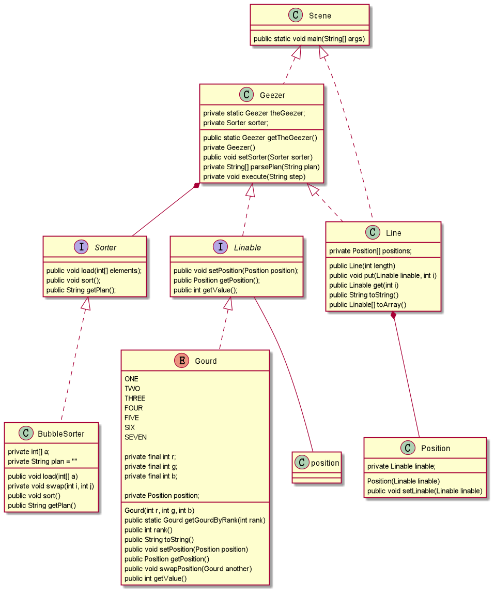
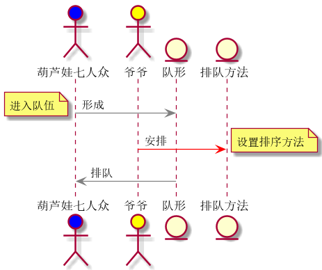

example的类图与Scene中main方法执行过程中的对象时序图如下：

参考example文件，把文件分成几个部分：
(1)接口Sorter和它的实现类BubbleSorter。(2)接口Linable和它的实现类Gourd。(3)Line和Geezer。

（1）接口Sorter中提供了加载数组、排序、返回排序信息的方法名，然后在BubbleSorter对其进行具体的实现，这样做可以实现各种不同的排序方法来完成Sorter接口，然后统一使用接口的Sorter来调用以此来屏蔽具体的排序方式。因为此处没有使用模板，所以仅仅可以对int类型的数据进行排序。

（2）Gourd实现接口Lineble,葫芦娃需要排序，但是此处并不知道他们具体需要按照什么样的阵容排序，因此仅仅完成了交换位置，获取位置等基本方法。虽然接口Linable与position紧紧耦合，但是这里并没有对其定义。

（3）Line类描述了排队的具体样式，通过内部类position将其与排序的东西（葫芦娃）隔离开来，而position作为内部类又可以封装在Line类中。Geezer拥有一个静态成员，并且构造函数申明成private，这就确保了仅有一个geezer对象并且在使用时才会生成，geezer中的排序没有直接对line数组进行排序，而是将数值取出排序后根据记录再对line进行排序，其实这里也照应着之前提到排序只能针对int类型的问题。

作业二和三合成一个proj,只需要在Sence中调整formation成Line或者Square即可切换排队方式，通过length调整人数（初始64人的方阵（8*8））

可视化结果如下

